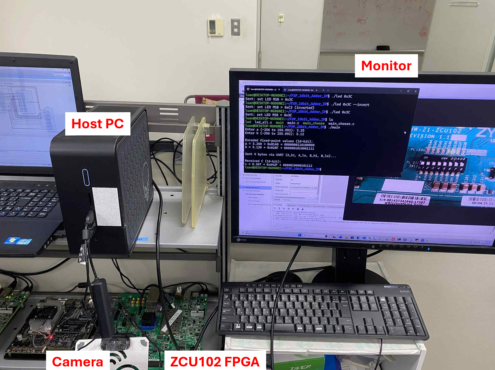

## BASIC_IC_COURSE_16-bit-Fixed-Point-Adder

### Introduction
This project implements a 16-bit fixed-point adder in Verilog HDL and runs on the ZCU102 FPGA board. The fixed-point format is defined as 1-bit sign, 8-bit integer, and 7-bit fractional.

### Design Summary
- Input: two 16-bit signed fixed-point numbers (1 sign, 8 integer, 7 fractional)
- Output: one 16-bit signed fixed-point result
- Target Device: Xilinx ZCU102 FPGA
- Language: Verilog

### Local Setup
The local setup shows the physical connection between the ZCU102 FPGA, host PC, and monitor in a standard laboratory environment.

### Remote Setup
The remote setup allows students to access and control the FPGA board through UltraViewer or AnyDesk. It enables remote learning and real-time observation of FPGA operation.

### Operation Result
The hardware result shows successful fixed-point addition through UART communication between the PC and the FPGA. The output demonstrates correct encoding and decoding of 16-bit fixed-point values.

### Video Tutorial
A full step-by-step demonstration of this project can be viewed here:  

### Author
Pham Hoai Luan  
Nara Institute of Science and Technology (NAIST), Japan